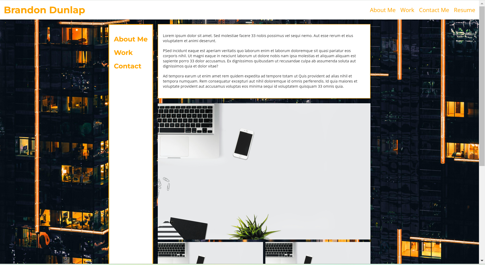
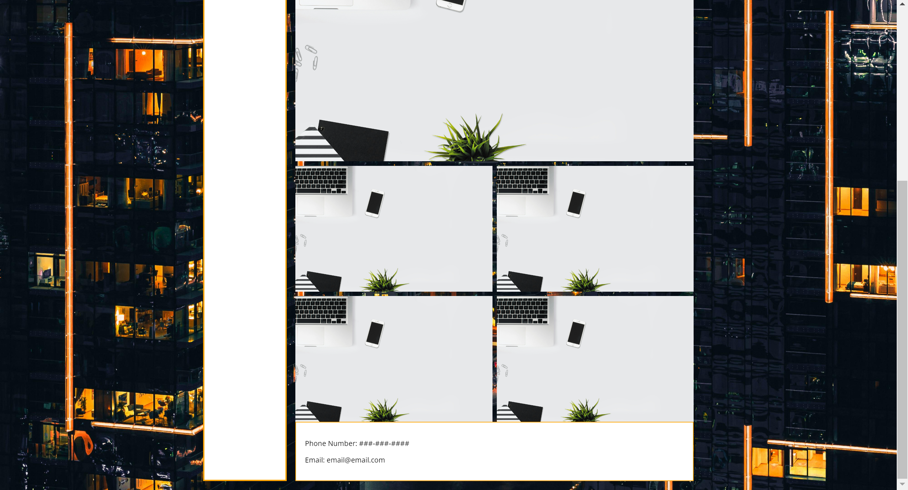

# Purpose

The purpose of this code is to create a portfolio that can be used to showcase current and future projects. This portfolio also acts.

## Screenshots

Below are screenshots for what the code looks like displayed in a live server.

## Link to Deployed Application

[https://brandondunlap.github.io/bootcamp-challenge-2/](https://brandondunlap.github.io/bootcamp-challenge-2/)

## License

Please Refer to the LICENSE in the repo.
